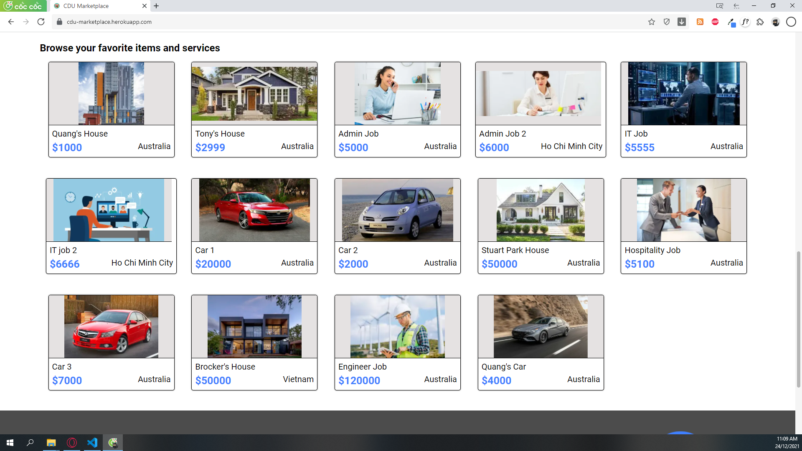

# CDU Marketplace

A simple website created with MongoDB, Express, NodeJS and React. Created with a purpose to learn about the technology stack and enhance the ability in web design.

## Table of contents

- [Technologies and libraries used](#technologies-and-libraries-used)
- [Launch](#launch)
- [Features](#features)

## Technologies and libraries used:

- HTML5/ CSS3/ JavaScript
- SCSS
- React v17
- Express v4
- NodeJS v12
- MongoDB - Mongoose
- Axios 

## Launch

### Locally on your computer
1. Fork and download the codebase on the project's GitHub.

2. Install dependencies and devDependencies in project root folder

```
cd cdu-marketplace
npm i
```

3. Start a backend server first which will connect the application to API endpoints
```
node server.js
```
4. Start a react application (development environment)
```
npm start
```
5. The app will run on localhost with the default port is 3000.

### Online Preview
- Online presentation of the website can be found at [CDU Marketplace](https://cdu-marketplace.herokuapp.com/)


### Browser Compability
- Tested on Chrome v96, Modzilla v88, Edge v96

## Features

- Generate list of items getting from back-end databases.



- Generate single item information based on user interaction (click).


- Basic search function by words included (search function by category and location are not included yet.)


- Basic Sign In and Register function (will be logged out when refresh the page.)


- Post new item with limit to 1 image for each (requires login).


